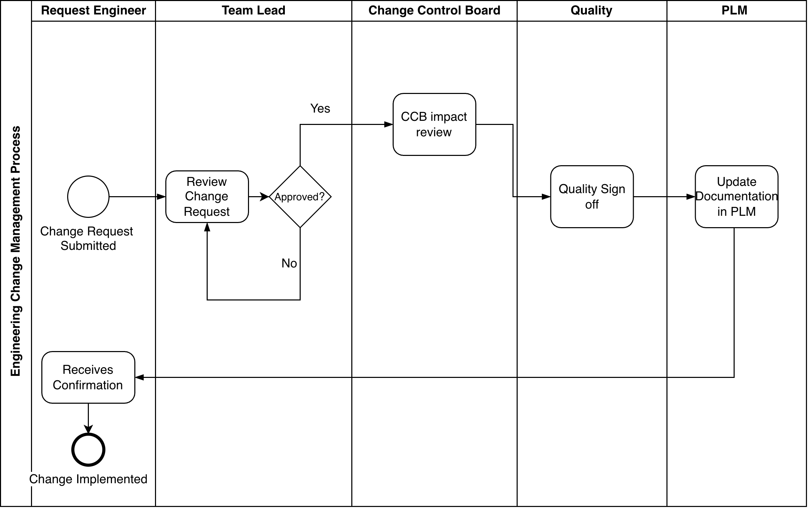
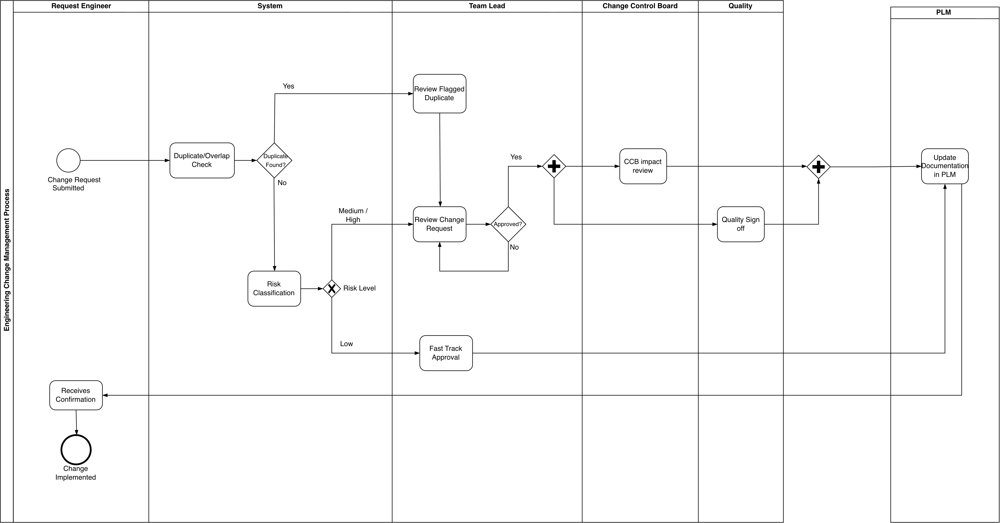

# Engineering Change Management (ECM) Process Redesign

**Scaling approval workflows for distributed engineering teams**

## Overview

Large engineering organizations with hundreds of engineers across multiple product lines and regions often struggle to manage engineering changes consistently. When every change request — from a minor labeling fix to a safety-critical redesign — goes through the same sequential approval chain, the process becomes a bottleneck: engineers wait, reviewers are overloaded, and there's no visibility into where a request actually stands.

This project analyzes that problem end-to-end: documenting the current (as-is) process, diagnosing why it breaks down at scale, designing an improved (to-be) process, and empirically validating the diagnosis using process mining on a synthetic event log.

## Problem Statement

A distributed engineering organization (~700 engineers across product lines and regions) needs a scalable, transparent, and appropriately-prioritized process for managing engineering change requests — without sacrificing the governance and quality control that change management exists to provide.

## As-Is Process

The current process routes every change request through the same sequential chain: submission → Team Lead review → Change Control Board (CCB) review → Quality sign-off → PLM documentation update → confirmation to the requesting engineer.

### Pain Point Analysis

Analyzing the as-is process against a scenario of ~700 engineers surfaces four structural weaknesses:

**1. Review capacity does not scale with organizational size.**
With approximately 700 engineers submitting change requests through the same fixed review chain (Team Lead → CCB → Quality), every request is processed by the same small group of reviewers, regardless of how many engineers are generating requests. As the organization grows, request volume increases, but reviewer capacity stays fixed — creating a structural bottleneck rather than an occasional delay.

**2. No risk-based prioritization.**
The process applies identical scrutiny to every change, regardless of its actual complexity or risk — a minor labeling fix goes through the same Team Lead → CCB → Quality chain as a safety-critical structural redesign. This has two consequences: reviewer time is spent on low-risk changes that could reasonably be approved with lighter oversight, and — more critically — high-priority changes queue behind low-priority ones with no mechanism to fast-track them, since the process treats all requests as equally urgent.

**3. No visibility into status or timelines.**
The process provides no mechanism for the requesting engineer to track where their request currently stands or how long it is likely to take. Once submitted, a request effectively disappears from the requester's view until a decision is made — there is no status update, no estimated timeline, and no visibility into whether a request is progressing normally or stuck at a particular stage. This makes it difficult for engineers to plan dependent work, and it means delays can go unnoticed internally, since nothing in the process flags a request that has been sitting too long at any one stage.

**4. No cross-regional or cross-product-line visibility.**
The process handles each change request in isolation, with no shared view across product lines or regions. If two engineers in different parts of the organization submit similar or conflicting changes around the same time, nothing in the process surfaces this overlap — each request moves through its own independent review chain unaware of the other. This creates a risk of duplicated effort (two teams solving the same problem separately) or, more seriously, conflicting changes both being approved without anyone catching the conflict before implementation.

## Process Mining Validation

To empirically test the pain-point analysis rather than rely on it purely as a conceptual argument, a synthetic event log of 150 change requests moving through the as-is process was generated and analyzed using **Disco** (Fluxicon).

The resulting process map confirms the bottleneck identified conceptually: the transition into **CCB Impact Review averages 4 days**, compared to well under 2 days combined for every other step in the process — submission to review (12.9 hrs), CCB to Quality (41.3 hrs), Quality to PLM update (6.3 hrs), and PLM update to confirmation (2.2 hrs). CCB Impact Review alone accounts for more cycle time than every other step in the process combined, confirming it as the single largest contributor to overall approval delay and directly supporting the case for the redesign below.

## To-Be Process

### Redesign Rationale

**1. Risk-based routing.**
In the as-is process, every request — regardless of complexity — went through the same full review chain, with no way to prioritize based on urgency or risk. To fix this, a risk classification step was introduced right after submission, categorizing each request as Low, Medium, or High risk. Low-risk requests are routed through a fast-track approval, while Medium/High-risk requests continue through the full review chain. This ensures reviewer time is spent where it matters most, and trivial changes no longer wait behind critical ones.

**2. Duplicate/overlap check.**
The as-is process had no way to detect duplicate or conflicting requests across product lines and regions. A duplicate/overlap check was added immediately after submission, flagging requests that overlap with existing active requests before they proceed further — catching duplication or conflicts early, before both are separately approved. Flagged requests are routed to the Team Lead for human judgment before continuing into normal review.

**3. Parallel CCB and Quality review.**
In the as-is process, CCB review and Quality sign-off happened sequentially — Quality couldn't begin until CCB finished, extending total review time. This is the exact bottleneck the process mining validation confirmed empirically. The redesigned process runs CCB and Quality review in parallel for Medium/High-risk requests, cutting the total time these two stages take without reducing the scrutiny either one applies.

**4. Status visibility (conceptual).**
Although not shown as a separate step in the diagram, a real implementation of this redesign would also include automated status notifications sent to the requesting engineer at each major stage transition. This directly addresses the visibility gap identified in the pain-point analysis — engineers would always know where their request currently stands, rather than submitting a request and hearing nothing until a final decision.

## Estimated Impact

Assuming a reasonable share of change requests in a large distributed engineering organization are genuinely low-risk (e.g., minor documentation updates, labeling changes) — a conservative estimate might put this at 40-50% of total volume — the redesigned process would allow roughly half of all requests to bypass the CCB and Quality review entirely, moving through a lightweight fast-track approval instead. For the remaining medium/high-risk requests, running CCB and Quality review in parallel rather than sequentially removes one of the two review stages from the critical path.

Combined, these two changes could realistically reduce average approval cycle time by an estimated **30-40%**, while maintaining full governance and quality control for the requests that genuinely need it. This estimate is illustrative rather than measured — validating it in a real deployment would require tracking actual cycle times before and after rollout.

## Tools Used

- **BPMN 2.0** modeling — draw.io (diagrams.net)
- **Process mining** — Disco (Fluxicon)
- **Synthetic data generation** — Python

## Possible Extensions

- Replace the synthetic event log with real (anonymized) organizational data
- Model the "confirmed duplicate" rejection path in more detail
- Simulate the to-be process to validate the estimated 30-40% impact quantitatively

## Author

Wishal Fatima — [LinkedIn](https://www.linkedin.com/in/wishal-fatima-310160200/) | [GitHub](https://github.com/wishalfatima)
